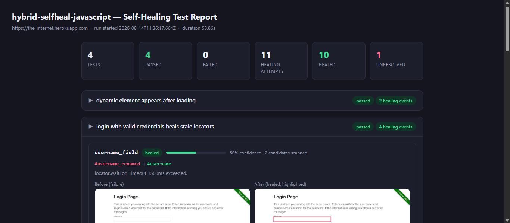

# hybrid-selfheal-javascript

An official [Playwright Test](https://playwright.dev/docs/intro) (`@playwright/test`, plain JavaScript)
framework with a heuristic **self-healing locator engine**, exercised end-to-end against the live
public site [the-internet.herokuapp.com](https://the-internet.herokuapp.com). This is the JavaScript
port of a 4-language (Java / JavaScript / TypeScript / Python) reference implementation; the design and
scoring algorithm are identical across all four ports.



## What "self-healing" means here

There is **no LLM, no API key, and no network calls beyond the page under test.** Healing is a small,
deterministic heuristic scoring algorithm.

Every locator used in a test is a `SmartLocator`: a primary CSS selector (deliberately made **stale**,
simulating a UI refactor that broke the old selector) plus a descriptor of the element's stable
characteristics — expected tag, key attributes (`id`, `data-testid`, `name`, `type`, `role`,
`placeholder`, `class`), and expected visible text.

The healing engine's `find(page, smartLocator, events)` function:

1. Tries the primary CSS selector with a short (1500ms) `waitFor({ state: 'attached' })`. If it
   resolves, no healing is needed — the locator is returned as-is.
2. On timeout, it takes a full-page "before" screenshot, then in a single `page.evaluate()` call scans
   every element of the descriptor's expected tag on the live page, pulling back index, tag, id, name,
   `data-testid`, class list, type, placeholder, role, href, and trimmed text (first 200 chars).
3. Each candidate is scored against the descriptor:
   - Wrong tag → score 0 (skipped).
   - Otherwise start at a base of `0.10`, then add weighted bonuses for exact `id` (+0.30),
     `data-testid` (+0.30), `name` (+0.25), `type` (+0.15), `role` (+0.10) matches, plus fuzzy-text
     contributions for `placeholder` (+0.10 × similarity), `class` overlap (+0.10 × Jaccard), and
     visible text (+0.30 × similarity). Capped at `1.0`.
   - Text similarity is a Dice coefficient over character bigrams (case/whitespace-insensitive);
     class overlap is Jaccard similarity of the two class-token sets.
4. The highest-scoring candidate wins, subject to a confidence threshold of **0.35**:
   - Below threshold (or zero candidates) → an `"unresolved"` healing event is logged and a
     `HealingFailedError` is thrown. The engine **never guesses**.
   - Above threshold → a fresh selector is built from the winning candidate's *own* attributes
     (`#id` → `[data-testid="…"]` → `tag[name="…"]` → `tag:has-text("…")` → `tag:nth-of-type(n)`,
     in that preference order), the element is located, best-effort highlighted (red outline), an
     "after" screenshot is taken, a `"healed"` event is logged, and the healed `Locator` is returned.

## How healing events reach the HTML report

Playwright Test's `Reporter` API only sees what test code explicitly attaches to a test result. The
bridge:

- `selfheal/fixtures.js` defines a custom `heal` fixture (via `test.extend()`) that hands each test a
  `find()` bound to that test's `page` plus an in-memory `events` array. On teardown it calls
  `testInfo.attach('healing-events', { body: Buffer.from(JSON.stringify(events)), contentType:
  'application/json' })`.
- `selfheal/reporter.js` is a custom `Reporter` (wired into `playwright.config.js`) that:
  - `onBegin`: deletes and recreates `report/screenshots/` so stale PNGs never linger, records the run
    start time.
  - `onTestEnd`: reads the `healing-events` attachment off each test result and accumulates
    `{ name, status, healingEvents }`.
  - `onEnd`: writes `report/healing-report.json` and renders `report/index.html` (via string
    substitution into a template constant in `selfheal/reportTemplate.js`) — no server needed, the
    report opens straight from disk (`file://`).

## Project layout

```
package.json                    # @playwright/test devDependency
playwright.config.js            # reporter: [['list'], ['./selfheal/reporter.js']]
selfheal/
  smartLocator.js                 # SmartLocator factory
  similarity.js                   # textSimilarity() (Dice/bigram), classOverlap() (Jaccard)
  healingEngine.js                 # find(page, smartLocator, events) - the healing algorithm
  fixtures.js                      # test.extend() defining the `heal` fixture
  reporter.js                      # custom Playwright Test Reporter
  reportTemplate.js                # HTML_TEMPLATE string constant
tests/
  login.spec.js                    # 3 tests against /login
  dynamicLoading.spec.js           # 1 test against /dynamic_loading/1
report/                          # generated: index.html, healing-report.json, screenshots/
```

## Target site

[https://the-internet.herokuapp.com](https://the-internet.herokuapp.com) — `/login` and
`/dynamic_loading/1`.

## Setup

```bash
npm install
npx playwright install chromium
```

## Run

```bash
npx playwright test
```

Then open `report/index.html` directly in a browser (no server required), or inspect
`report/healing-report.json` for the raw data.

## What's demonstrated (verified by an actual run against the live site)

All 4 tests pass:

1. **`login with valid credentials heals stale locators`** — `username_field`, `password_field`,
   `login_button`, and `flash_success_message` all have deliberately stale primary selectors; all four
   heal successfully and the test logs in and asserts the success flash text.
2. **`login with invalid password shows healed error flash`** — same healed username/password/login
   locators, then a healed `flash_error_message` asserts the lowercase error text contains `"invalid"`.
3. **`healing reports unresolved when no real match exists`** — `logout_button_before_login` is a
   locator for an element that genuinely does not exist on `/login` (the only real button says
   "Login"). The engine scans real candidates (`candidatesConsidered >= 1`), scores the "Login" button
   low against the "Logout This Element Does Not Exist…" text, stays below the 0.35 threshold, and
   correctly throws `HealingFailedError` instead of guessing — the test passes by asserting that
   rejection.
4. **`dynamic element appears after loading`** — clicks a healed `start_button`, then finds a healed
   `finish_message` and explicitly waits for it to become visible after the page's 5-second loading
   spinner; text is asserted to equal `"Hello World!"`. There are two `<h4>` elements on this page; the
   heading text of the other one scores clearly lower and is correctly not selected.

Actual confidence scores observed in a real run (`report/healing-report.json`), all comfortably above
the 0.35 threshold for healed events:

| Locator | Outcome | Confidence | Candidates scanned |
|---|---|---|---|
| `start_button` | healed | 0.40 | 1 |
| `finish_message` | healed | 0.40 | 2 |
| `username_field` | healed | 0.50 | 2 |
| `password_field` | healed | 0.50 | 2 |
| `login_button` | healed | 0.55 | 1 |
| `flash_success_message` | healed | 0.49 | 9 |
| `flash_error_message` | healed | 0.49 | 13 |
| `logout_button_before_login` | **unresolved** | 0.12 | 1 |

Every `screenshotBefore` / `screenshotAfter` path referenced in `healing-report.json` was verified to
exist as a real, non-empty PNG under `report/screenshots/`, and `report/index.html`'s inlined
`const REPORT_DATA = …;` was verified to be valid JSON matching `healing-report.json`.
